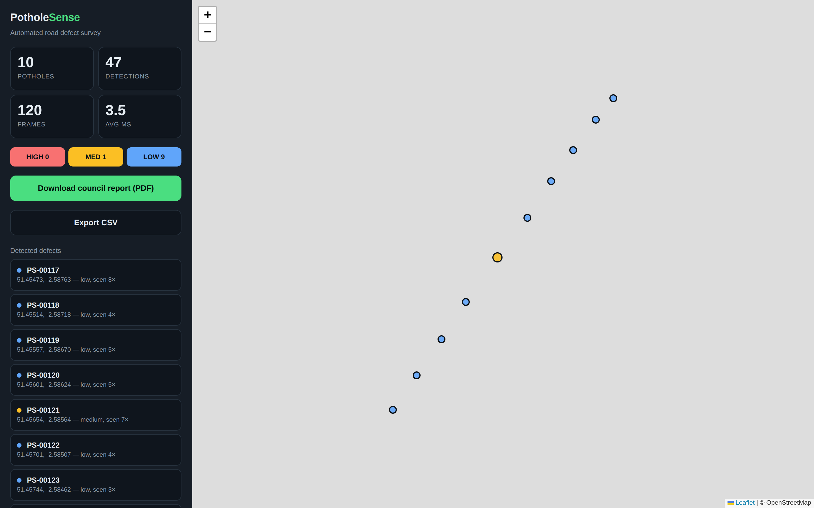

# PotholeSense

Finding potholes automatically while you drive, using a phone camera.

You clip your phone into a windscreen holder, press start, and drive normally.
The phone films the road ahead. Software running on my laptop looks at each
frame, decides whether there is a pothole in it, works out roughly where that
pothole is in the real world, and puts a pin on a map. When you get home you
can download a PDF listing everything it found, sorted by how bad each one
looked, with a photo of each.



## Why I made it

If you want to report a pothole to the council you have to stop somewhere safe,
find their website, work out what road you were on and upload a photo. Almost
nobody bothers. So councils mostly hear about potholes when a resident
complains or when someone's suspension breaks.

Meanwhile a lot of cars drive down those roads every day. If one of them could
log the potholes automatically, without the driver doing anything, you would
get far better coverage for no extra effort from anybody.

## How it works

Four things have to happen, and only the first one is what people normally mean
when they say "AI".

**1. Spotting a pothole in a photo.**
This uses a neural network called YOLO. The short version of how those work:
you collect a few thousand photos of roads, draw a box around every pothole by
hand, and then show the network the photos over and over until it learns what
the boxes have in common. Afterwards you can hand it a photo it has never seen
and it will draw its own boxes, along with a number from 0 to 1 saying how
confident it is. I train mine on a public dataset of labelled pothole photos.
There is a notebook in `notebooks/` that does this.

**2. Working out where the pothole actually is.**
This is the part that took me longest and it is the part I would talk about in
an interview.

The obvious approach is to record the phone's GPS position at the moment the
camera sees a pothole. That turns out to be wrong. The pothole is not under the
car, it is somewhere ahead of it, anywhere from about 5 to 30 metres away. So
the position you record is not the pothole's position, it is yours. Worse, as
you drive towards it you keep seeing the same pothole in frame after frame, and
each time you are in a different place, so a single hole ends up smeared across
about 35 metres of road.

The fix is to stop using the car's position and calculate the pothole's own.
The camera is at a known height above the road and tilted down at a known
angle. That means a point near the bottom of the picture is close to the car
and a point near the top is further away, and the relationship between the two
is just trigonometry. So from where the box sits in the picture I can work out
how far ahead the pothole is and how far to the left or right, then add that
offset to the car's GPS position and the direction it is pointing.

The useful side effect is that every frame that sees the same pothole now
produces roughly the same answer, instead of a different one each time.

**3. Not reporting the same pothole twenty times.**
Driving past one pothole at 30 mph produces about seven detections. If each
became its own report the council would get a useless list full of duplicates.
So before saving anything, the program checks whether it already knows about a
pothole within a few metres of this one, and if so treats it as another sighting
of the same hole rather than a new one. It averages the positions as it goes,
which has a nice consequence: GPS is noisy by a few metres in a random
direction each time, so averaging several sightings cancels most of that error
out instead of adding it up.

**4. Deciding which ones matter and writing the report.**
Councils cannot fix everything at once, so the report is ordered worst first.
I estimate severity from how large the pothole looks in the frame, weighted by
how confident the detector was and by how many separate times it was seen. This
is a rough measure and I have deliberately kept it simple, because a council has
to be able to explain why one hole was scheduled before another.

## Does it actually work

Testing this properly is awkward. You cannot easily check whether the program
got a pothole's position right, because you would need to know the true position
to compare against, and going out and surveying real potholes with proper
equipment was not realistic.

So I wrote a simulator instead. It places potholes at coordinates I choose,
drives an imaginary car past them, and draws what the camera would have seen
from each position along the way. The program under test only ever receives the
pictures and a deliberately noisy GPS signal, exactly as it would in a real car.
Then I compare the positions it reports against the ones I planted.

Two configurations, because they measure different things:

| Setup | Precision | Recall | F1 | Average position error |
|---|---|---|---|---|
| Perfect detector, real geometry and merging | 1.00 | 1.00 | 1.00 | 1.1 m |
| Simple non-AI detector, whole pipeline | 0.30 | 0.50 | 0.37 | 8.2 m |

The first row feeds in perfect boxes on purpose. That takes the detector out of
the equation so the numbers only reflect the geometry and the duplicate merging.
It finds all six planted potholes and places them within 1.1 metres on average,
despite the GPS signal being off by up to 4 metres. That works because of the
averaging described above.

The second row swaps YOLO for `app/baseline.py`, a detector I wrote using
ordinary image processing rather than machine learning. It just looks for dark
blobs of roughly the right shape. It manages an F1 of 0.37, which is poor, and
it is supposed to be. It cannot tell a pothole from a shadow or a drain cover.
It is there as something to measure the trained model against, so that when I
say the neural network scores X, there is a number showing what X is worth.

(Precision means how many of the things it flagged were really potholes. Recall
means how many of the real potholes it managed to find. F1 combines the two into
one number.)

## What it looks like from the inside

The phone does not do any of the thinking. It runs a small web page that turns
on the camera, reads the GPS, and sends about three frames a second to my laptop
over WiFi. The laptop does the detection and sends back the boxes, which the
phone draws on screen so you can see it working as you drive. Everything except
that one web page is Python.

```
  PHONE (in a windscreen holder)        LAPTOP
 ┌─────────────────────────────┐      ┌──────────────────────────────┐
 │ camera, 3 frames per second │─────▶│ POST /api/frame              │
 │ GPS position and heading    │ WiFi │   detect       detector.py   │
 │ draws boxes on screen       │◀─────│   locate       localise.py   │
 └─────────────────────────────┘      │   merge/save   storage.py    │
                                      │   map, PDF, CSV              │
                                      └──────────────────────────────┘
```

I would have preferred to run the detection on the phone itself, but doing that
in real time needs a proper Android or iOS app written in Kotlin or Swift, and I
wanted to keep the whole thing in Python. Sending the frames to a laptop over
the phone's own hotspot gets the same result with one language. I did leave the
door open though: there is an endpoint, `POST /api/detection`, that accepts
detections worked out somewhere else, so moving the model onto the phone later
means changing the phone code and nothing else. The training notebook already
exports the model in the formats a phone would need.

## Running it

You need Python 3.10 or newer.

Windows, in PowerShell:

```powershell
python -m venv .venv
.venv\Scripts\Activate.ps1
pip install -r requirements.txt
```

macOS or Linux:

```bash
python -m venv .venv && source .venv/bin/activate
pip install -r requirements.txt
```

If PowerShell refuses to run the activate script, run
`Set-ExecutionPolicy -Scope Process -ExecutionPolicy Bypass` first. Be aware
that the install pulls in PyTorch, which is a large download.

To try it without a car, a phone or a trained model, start the server in one
terminal and the simulator in another:

```powershell
$env:POTHOLESENSE_STUB=1; python run.py
python scripts/simulate_drive.py --frames 120 --potholes 6 --oracle
```

Then open `http://localhost:8000/dashboard` and watch the pins appear.

To use it in a car, start it with `--https`:

```powershell
python run.py --https
```

It has to be HTTPS because browsers will not give a web page access to the
camera or GPS over an ordinary connection. It prints an address like
`https://192.168.1.33:8000/`. Open that on your phone, which needs to be on the
same network as the laptop. Your browser will warn you about the certificate,
which is expected, because the certificate is one your own laptop just made up
rather than one bought from a certificate authority. Accept it, allow the camera
and location, and press Start survey. If the page will not load at all it is
usually Windows Firewall blocking the connection.

### Setting it up for your car

The position calculation depends on four measurements in `config.py`. Get these
wrong and everything will be reported in the wrong place.

```python
CAMERA_HEIGHT_M  = 1.25   # how high the lens sits above the road
CAMERA_PITCH_DEG = 8.0    # how far the phone tilts down from level
CAMERA_VFOV_DEG  = 48.0   # how much the camera sees vertically
CAMERA_HFOV_DEG  = 65.0   # and horizontally
```

Measure the first with a tape measure and the second with the phone's own spirit
level app. To check them, park with something on the ground 10 metres in front
of the car and confirm the program reports it at about 10 metres.

## Training the model

Open `notebooks/train_pothole_yolo.ipynb` in Google Colab and set the runtime to
use a GPU. It downloads a labelled pothole dataset, trains for about 25 minutes,
compares the result against the simple non-AI detector, and gives you a weights
file. Put that file in `models/` and restart the server. Visiting `/health` will
tell you which model it loaded.

## Tests

```bash
python -m pytest tests/ -v
```

31 tests. Most of them check the geometry, by converting a known real-world
position into a picture position and back again and confirming you get the same
number out. The rest cover the duplicate merging and the severity scoring.

## What it cannot do

- **It is guessing at severity, not measuring it.** You cannot tell how deep a
  hole is from a single photograph. A wide shallow patch and a small deep one
  can look the same to it.
- **It assumes the road is flat.** The position calculation relies on this. On a
  hill or a steeply cambered road the estimates get worse, which is why anything
  further than 35 metres away is thrown out rather than reported badly.
- **The numbers above come from the simulator, not real roads.** Testing it
  properly on public roads is the obvious next thing to do.
- **No council actually accepts these reports automatically.** The PDF is
  designed to make a manual submission quick, nothing more.

## Safety and the law

Set the phone up in a proper holder and start the survey before you move. Never
touch it while driving. Handling a phone at the wheel is illegal in the UK and
the whole design assumes you press one button and then drive normally without
looking at it. Filming public roads from a car is generally fine, but blur faces
and number plates if you publish any of the footage.

## Things I would like to add

- Running the model on the phone instead of a laptop
- Estimating depth, so severity is measured rather than guessed
- Looking up the road name so reports say where they are in words
- Comparing surveys over time, to see which potholes are new, worse, or fixed
